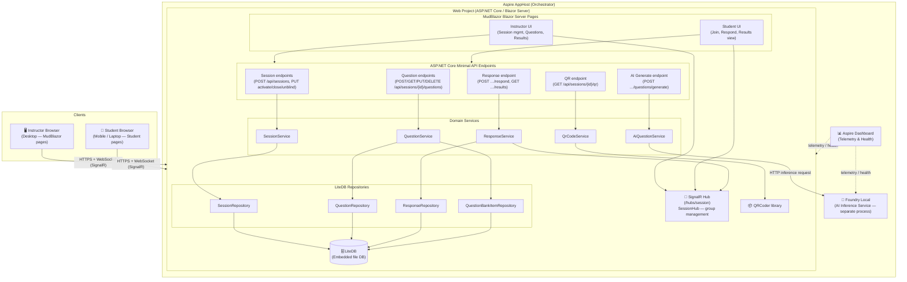
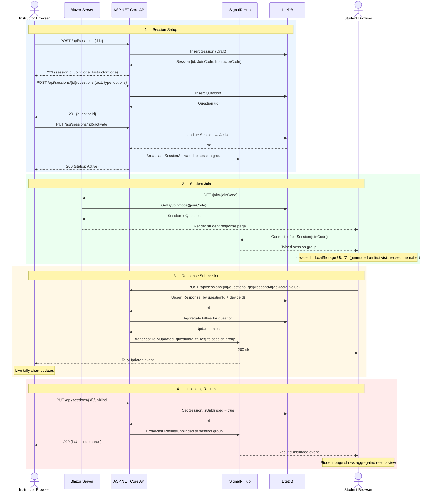
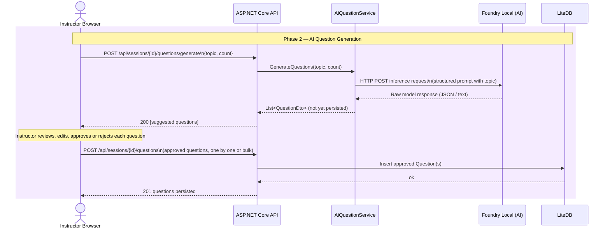

# Pulse — Architecture

---

## Solution Architecture

This diagram shows the full deployment topology of Pulse: how the Aspire AppHost orchestrates the Web server and Foundry Local, what lives inside the Web process, and how instructor and student browsers interact with it.

---

## Activity Flow

This sequence diagram traces the core classroom workflow end-to-end: an instructor sets up a session, students join via QR code, submit responses, and the instructor views live tallies — culminating in the optional unblinding of results to students.

---

## Phase 2 — AI Question Generation

This short sequence shows the Phase 2 AI-assisted question generation flow, where an instructor enters a topic and Foundry Local returns suggested questions for review before they are persisted.

