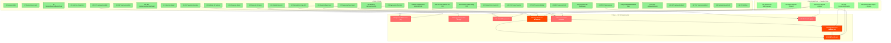

```mermaid
graph TD
    %% LEGEND / GROUPING
    subgraph DONE ["✅ Done / Closed"]
        D6["#6 Session Model"]
        D7["#7 SessionRepo.Insert"]
        D8["#8 SessionRepo.GetByJoinCode"]
        D9["#9 JoinCode Generator"]
        D10["#10 POST /api/sessions"]
        D11["#11 GET /api/sessions/{id}"]
        D12["#12 GET /api/sessions/join/{joinCode}"]
        D13["#13 Question Model"]
        D14["#14 QuestionRepo.Insert"]
        D15["#15 Validate MC options"]
        D16["#16 Response Model"]
        D17["#17 ResponseRepo.Upsert"]
        D19["#19 Validate DeviceId"]
        D20["#20 DeviceId JS helper"]
        D21["#21 Minimal Join Page (UI)"]
        D22["#22 PUT /api/questions/{id}"]
        D23["#23 DELETE /api/questions/{id}"]
        D24["#24 PUT questions/reorder"]
        D28["#28 GET /api/sessions?instructorCode"]
        D29["#29 Instructor Session List (UI)"]
        D30["#30 Session Create Dialog (UI)"]
        D31["#31 Student Join Route (UI)"]
        D33["#33 Aggregation Function"]
        D37["#37 GET /sessions/{id}/qr"]
        D38["#38 QR Component (UI)"]
        D39["#39 InstructorCode Middleware"]
        D40["#40 CSV Parser Function"]
        D43["#43 QuestionBank Model & Repo"]
        D44["#44 POST /api/questionbank"]
        D45["#45 GET /api/questionbank"]
        D47["#47 PUT /sessions/unblind"]
        D48["#48 /api/admin/export-db"]
        D50["#50 CI Workflow"]
    end

    subgraph DONE_PENDING_CLOSE ["✅ Functionally Done — Pending Close"]
        FD18["#18 POST /respond endpoint"]
        FD26["#26 Options List Subcomponent"]
        FD34["#34 GET /sessions/{id}/results"]
        FD41["#41 Import Preview Endpoint"]
        FD46["#46 Question Bank Import → Session"]
    end

    subgraph OPEN ["🔴 Open — Not Yet Implemented"]
        O25["#25 Question Editor Form (UI)"]
        O27["#27 Draggable Question List (UI)"]
        O32["#32 Student Response UI"]
        O35["#35 SignalR Server Broadcast"]
        O36["#36 SignalR Client Handler (UI)"]
        O42["#42 Import Commit Endpoint"]
        O49["#49 Structured Logging"]
        O51["#51 E2E Test Script"]
    end

    %% Dependencies for open items from done items
    FD26 --> O25
    D22 --> O25
    D14 --> O25

    D24 --> O27

    FD18 --> O32
    D20 --> O32
    D21 --> O32

    D17 --> O35
    D33 --> O35
    FD18 --> O35

    %% THE ONLY INTER-OPEN DEPENDENCY
    O35 --> O36
    FD34 --> O36

    D40 --> O42
    FD41 --> O42
    D14 --> O42

    D10 --> O49
    FD18 --> O49

    O35 --> O51
    O36 --> O51
    FD34 --> O51
    FD18 --> O51

    %% Styling
    classDef done fill:#90EE90,stroke:#228B22,color:#000
    classDef funcDone fill:#98FB98,stroke:#3CB371,color:#000,stroke-dasharray:5 5
    classDef open fill:#FF6B6B,stroke:#CC0000,color:#fff
    classDef blocking fill:#FF4500,stroke:#8B0000,color:#fff,font-weight:bold

    class D6,D7,D8,D9,D10,D11,D12,D13,D14,D15,D16,D17,D19,D20,D21,D22,D23,D24,D28,D29,D30,D31,D33,D37,D38,D39,D40,D43,D44,D45,D47,D48,D50 done
    class FD18,FD26,FD34,FD41,FD46 funcDone
    class O25,O27,O32,O42,O49 open
    class O35,O36,O51 blocking
```