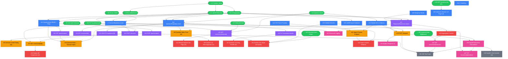

```mermaid
graph TD
    %% ── COMPLETED (green) ──────────────────────────────────────────────
    C1(["✅ #1/2 Solution Setup"])
    C3(["✅ #3 LiteDB Reference"])
    C4(["✅ #4 Error Middleware"])
    C5(["✅ #5 DI Registration"])
    C6(["✅ #6 Session Model"])
    C8(["✅ #8 GetByJoinCode"])
    C9(["✅ #9 JoinCode Generator"])
    C13(["✅ #13 Question Model"])
    C20(["✅ #20 DeviceId Client Helper"])
    C22(["✅ #22 PUT /questions/{id}"])
    C28(["✅ #28 GET /sessions (list API)"])
    C39(["✅ #39 InstructorCode Middleware"])

    %% ── WAVE 1 ──────────────────────────────────────────────────────────
    W7["#7 SessionRepository.Insert"]
    W14["#14 QuestionRepository.Insert"]
    W15["#15 Validate MC ≥2 Options"]
    W16["#16 Response Model"]
    W19["#19 Validate DeviceId"]
    W29["#29 Instructor Session List Page (UI)"]
    W40["#40 CSV Parser Function"]
    W43["#43 QuestionBank Model + Repo"]
    W48["#48 LiteDB Export Endpoint"]
    W50["#50 CI Workflow"]

    %% ── WAVE 2 ──────────────────────────────────────────────────────────
    W10["#10 POST /sessions"]
    W11["#11 GET /sessions/{id}"]
    W12["#12 GET /sessions/join/{code}"]
    W17["#17 ResponseRepository.Upsert"]
    W23["#23 DELETE /questions/{id}"]
    W24["#24 PUT /questions/reorder"]
    W44["#44 POST /questionbank"]
    W45["#45 GET /questionbank"]

    %% ── WAVE 3 ──────────────────────────────────────────────────────────
    W18["#18 POST /respond"]
    W25["#25 Question Editor Form (UI)"]
    W30["#30 Session Create Dialog (UI)"]
    W37["#37 GET /sessions/{id}/qr"]
    W41["#41 Import Preview Endpoint"]
    W46["#46 Question Bank → Session Import"]

    %% ── WAVE 4 ──────────────────────────────────────────────────────────
    W21["#21 Minimal Student Join Page (UI)"]
    W26["#26 Options List Subcomponent (UI)"]
    W27["#27 Question List Drag Handle (UI)"]
    W31["#31 Student Join Route /join/{code}"]
    W33["#33 Aggregation Function"]
    W38["#38 Display QR Component (UI)"]
    W42["#42 Import Commit Endpoint"]

    %% ── WAVE 5 ──────────────────────────────────────────────────────────
    W32["#32 Student Response UI"]
    W34["#34 GET /sessions/{id}/results"]
    W35["#35 SignalR Broadcast TallyUpdated"]
    W47["#47 PUT /sessions/{id}/unblind"]
    W49["#49 Structured Logging"]

    %% ── WAVE 6 ──────────────────────────────────────────────────────────
    W36["#36 SignalR Client Handler (UI)"]
    W51["#51 E2E Test Script"]

    %% ── DEPENDENCY EDGES ─────────────────────────────────────────────────
    C1 --> C3
    C1 --> C4
    C1 --> C5
    C3 --> W7
    C5 --> W7
    C6 --> W7
    C3 --> W14
    C5 --> W14
    C13 --> W14
    C13 --> W15
    C3 --> W43
    C5 --> W43
    C5 --> W48
    C28 --> W29

    %% Wave 1 → Wave 2
    W7 --> W10
    C9 --> W10
    W7 --> W11
    W7 --> W12
    C8 --> W12
    C13 --> W12
    W16 --> W17
    C3 --> W17
    C5 --> W17
    W14 --> W23
    W14 --> W24
    W43 --> W44
    W43 --> W45

    %% Wave 2 → Wave 3
    W17 --> W18
    W15 --> W18
    W19 --> W18
    W14 --> W25
    C22 --> W25
    W10 --> W30
    W7 --> W37
    W10 --> W37
    W40 --> W41
    W15 --> W41
    W43 --> W46
    W45 --> W46
    W14 --> W46

    %% Wave 3 → Wave 4
    W12 --> W21
    W25 --> W26
    W24 --> W27
    W12 --> W31
    W19 --> W31
    C20 --> W31
    W17 --> W33
    W37 --> W38
    W41 --> W42
    W14 --> W42

    %% Wave 4 → Wave 5
    W18 --> W32
    W33 --> W34
    C39 --> W34
    W18 --> W35
    W33 --> W35
    W7 --> W47
    W35 --> W47
    W7 --> W49
    W17 --> W49

    %% Wave 5 → Wave 6
    W35 --> W36
    W10 --> W51
    W18 --> W51
    W34 --> W51
    W35 --> W51

    %% Styles
    classDef done fill:#22c55e,stroke:#16a34a,color:#fff
    classDef wave1 fill:#3b82f6,stroke:#2563eb,color:#fff
    classDef wave2 fill:#8b5cf6,stroke:#7c3aed,color:#fff
    classDef wave3 fill:#f59e0b,stroke:#d97706,color:#000
    classDef wave4 fill:#ef4444,stroke:#dc2626,color:#fff
    classDef wave5 fill:#ec4899,stroke:#db2777,color:#fff
    classDef wave6 fill:#6b7280,stroke:#4b5563,color:#fff

    class C1,C3,C4,C5,C6,C8,C9,C13,C20,C22,C28,C39 done
    class W7,W14,W15,W16,W19,W29,W40,W43,W48,W50 wave1
    class W10,W11,W12,W17,W23,W24,W44,W45 wave2
    class W18,W25,W30,W37,W41,W46 wave3
    class W21,W26,W27,W31,W33,W38,W42 wave4
    class W32,W34,W35,W47,W49 wave5
    class W36,W51 wave6
```